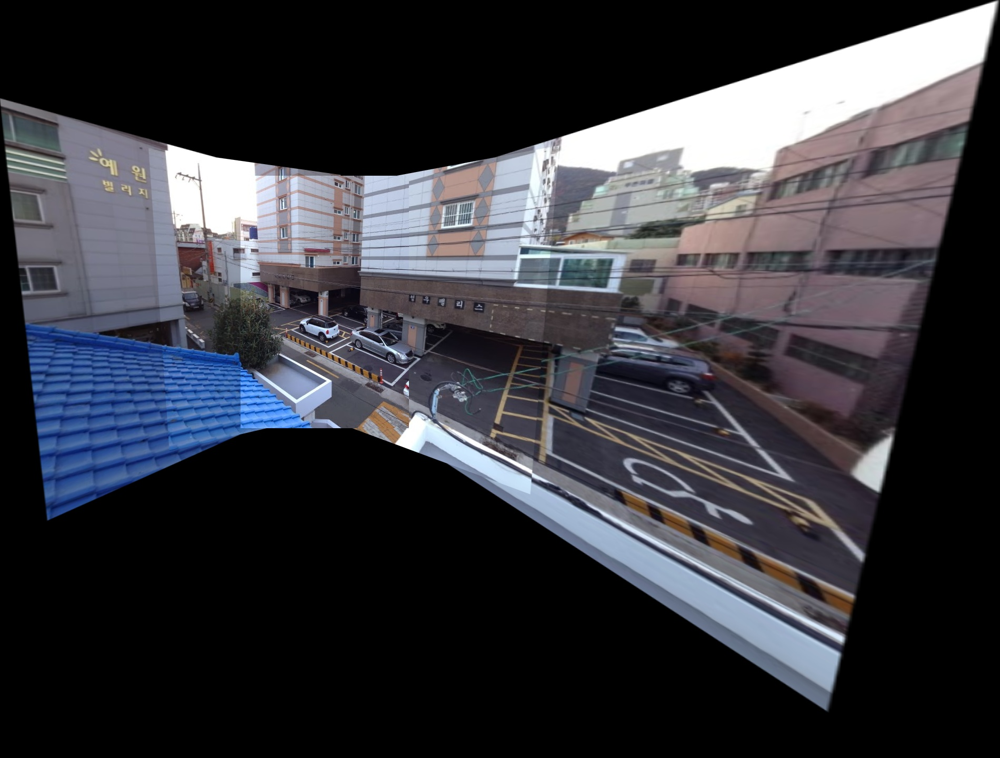
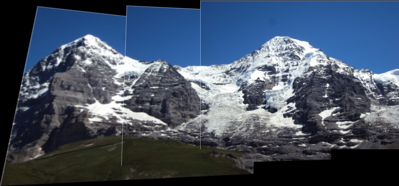
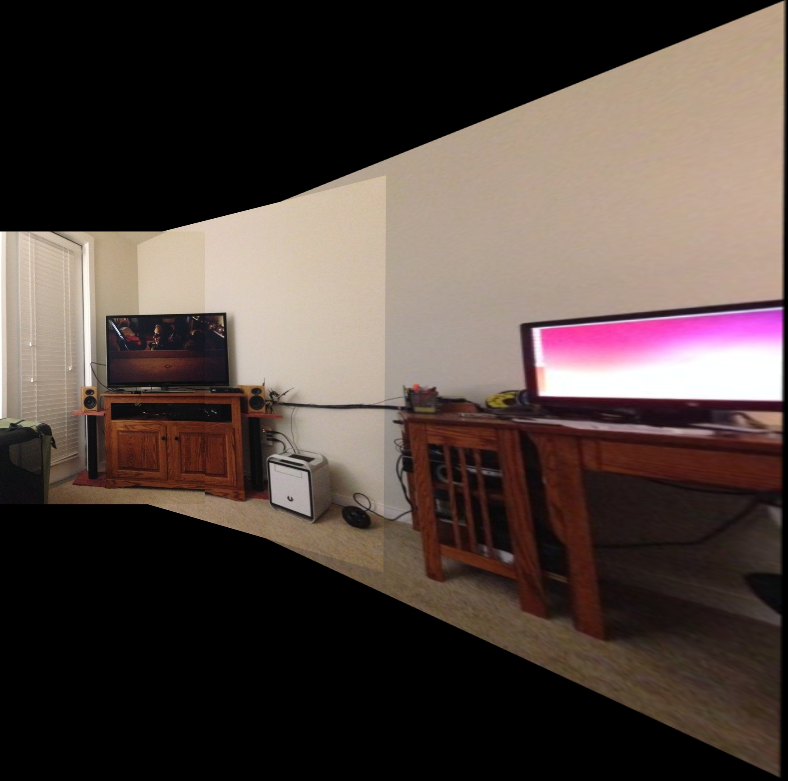

# Introduction

The algorithm uses Python and OpenCV to stitch multiple images together to create a panorama image.

Keypoint matching serves for calculating a homography which is used to stitch neighbouring images.

The images fed into the algorithm must be ordered, but the direction doesn't matter. They can be from right to left or
left to right and **in contrast to other public projects** also from up to down or down to up.

The algorithm stitches both halfs of the images and then combines those two panoramas to minimize the resulting skew.

# Installation

Create a virtual environment with Python 3 (repository is tested with Python 3.7) using e.g. `pyenv` or `conda` and
install the necessary packages by running: `pip install -r requirements.txt`
Used packages:
- `opencv`
- `matplotlib`
- `tqdm`
- `numpy`

# Usage

1. Create a .txt file where each row is a path to the image from the root of this project. The paths must be in order
   but the direction doesn't matter. Check `assets` for example files.
2. Run `python main.py --txt-path <Path to .txt file containing image paths>`. You can save the resulting image by
   providing a `--save-path` flag with the corresponding destination path.
3. If the algorithm fails it is mostly because it didn't find enough matched keypoints. In such cases the script has
   multiple hyperparameters, which you can experiment with. For more information on the different options
   run `python main.py --help`.
   
In some cases you would want to define a Region of Interest (ROI) in the images, in which keypoints should be detected. This is e.g. the case when you have a moving object in a still standing video. By selecting the Regions of Interest in every frame of the video you can create a panorama of the object by ignoring the background. For that specify the ROI after the image path in the .txt file like so (if no ROI is specified, like in the last row, whole image will be used): 
```
example/path1.jpg, (0, 350, 500, 700)
example/path2.jpg, (50, 400, 400, 600)
example/path3.jpg
```

# Demo

The assets directory contains demo files which you can use to try out the algorithm: (images are taken
from [here](https://github.com/kushalvyas/Python-Multiple-Image-Stitching) for comparison).

E.g. `python main.py --txt-path assets/files2.txt --downscale-factor 1 --kernel-size 1` will not blur
or downscale the images and will plot this resulting panorama:


Here are some other examples:


